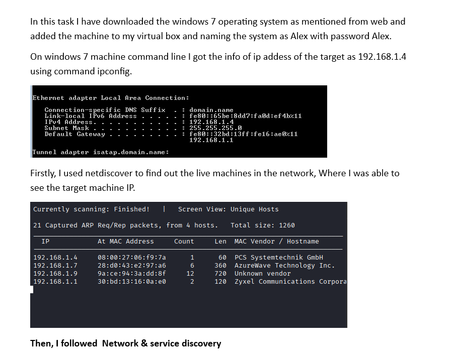
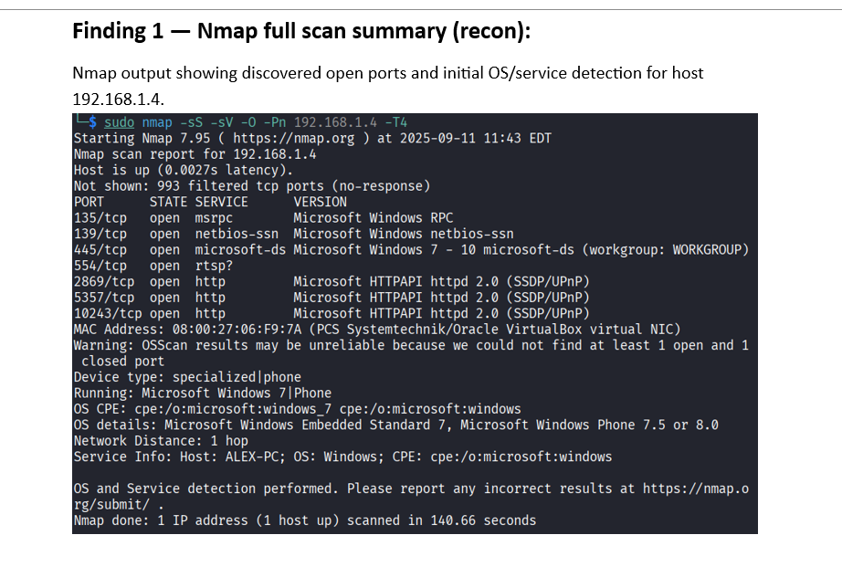
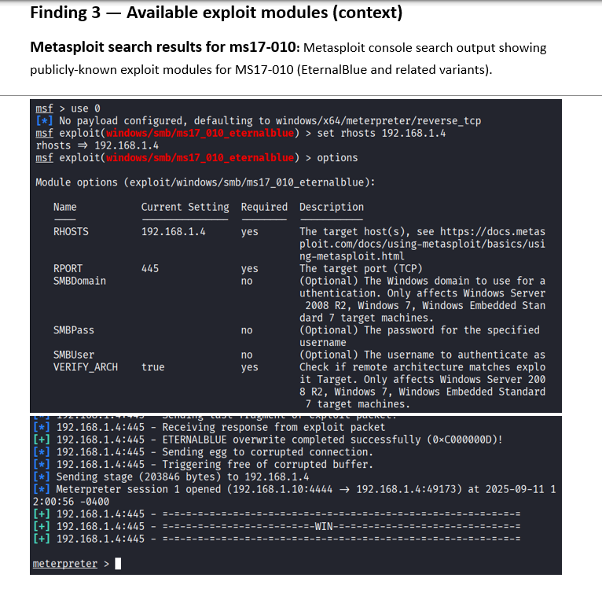
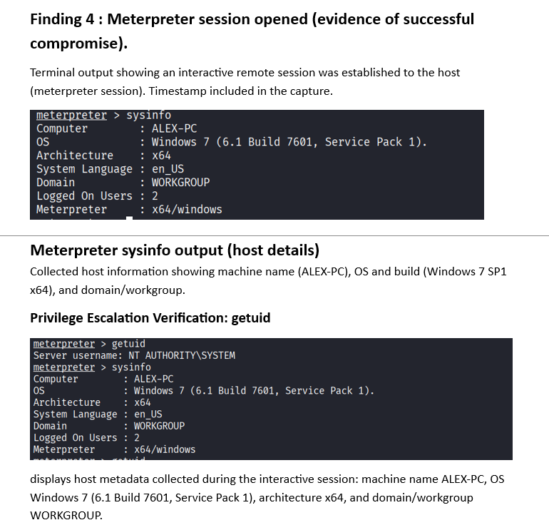
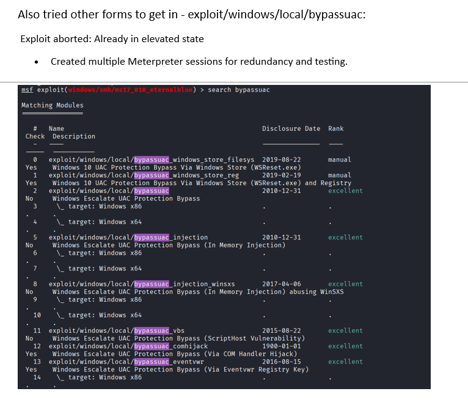
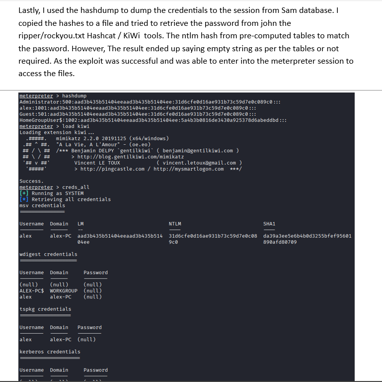
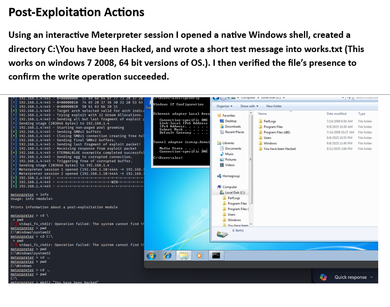

# Windows 7 Penetration Test: Task Findings

---

### 1. Introduction
This repository documents the findings of a penetration test on a Windows 7 virtual machine. The goal was to simulate a real-world hacking scenario, identify vulnerabilities, and demonstrate the process of exploitation, from setup and scanning to gaining access and post-exploitation actions.

The target system was a Windows 7 operating system installed on a virtual box, named **ALEX-PC**, with an assigned IP address of **192.168.1.4**.

---

### 2. Network and Service Discovery
The first step was to identify the live machines on the network using `netdiscover` and perform a full scan with `Nmap` to find open ports and initial OS/service detection.

* I got the IP address of the target machine using the `ipconfig` command.

* Then, I used `netdiscover` to find the live machines in the network, where I was able to see the target machine's IP.

* I performed a full scan using `Nmap` to find open ports and initial OS/service detection for the host 192.168.1.4.

---

### 3. Vulnerability Identification
* I performed a targeted scan using `Nmap`'s `smb-vuln` script. The script identified the host as **VULNERABLE** to the **Microsoft SMBv1 remote code execution vulnerability** known as **MS17-010 (CVE-2017-0143)**.

---

### 4. Exploitation and Session Gained
* I used `Metasploit` to search for available exploit modules for `ms17-010`, specifically the `exploit/windows/smb/ms17_010_eternalblue` module. The exploit was successfully executed, leading to a **Meterpreter session** on the target system.

* I confirmed that an interactive remote session was established to the host, with a timestamp included in the capture.

---

### 5. Post-Exploitation Actions
* Once the Meterpreter session was established, I used the `sysinfo` command to confirm the machine name (**ALEX-PC**) and OS (Windows 7 SP1 x64).

* I also attempted to use a `bypassuac` exploit, but the exploit aborted because the session was already in an elevated state.

* I used the `hashdump` command to try and dump the credentials from the SAM database. However, the passwords were not retrieved. The result ended up saying "empty string".

* Using an interactive Meterpreter session, I opened a native Windows shell, created a directory `C:\You have been Hacked`, and wrote a short test message into `works.txt` to confirm a successful write operation. I then verified the file's presence.

* I used the `getuid` command to show that the session was running with elevated privileges as `NT AUTHORITY\SYSTEM`.

---

### 6. Conclusion
During this authorized lab assessment, I identified a critical remote code execution vulnerability (**MS17-010**) on host **ALEX-PC (192.168.1.4)**. The vulnerability was verified through testing, which resulted in a successful remote interactive session, confirming that a full system compromise is possible on unpatched systems.
